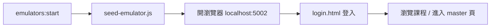
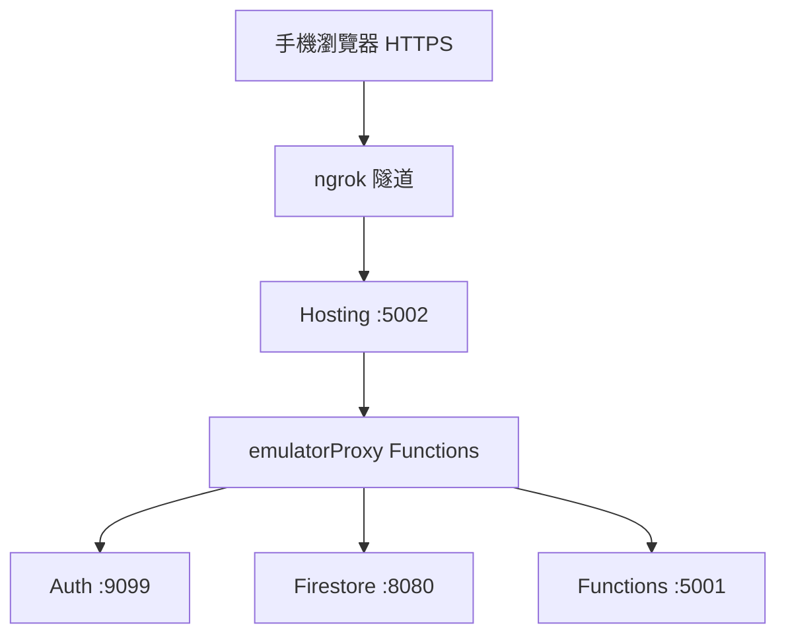

# 本地開發與 ngrok 外網預覽

本文件說明如何在開發機上啟動 **Firebase Emulator Suite**，並透過 **ngrok** 讓手機或其他裝置以 HTTPS 預覽本站（含 Google 登入、課程清單、付費課程權限）。

> 專案 ID：`e-learning-942f7`  
> 行為規範另見 [`AGENT.md`](../AGENT.md)。

---

## 1. 前置需求

| 項目 | 建議版本 / 說明 |
|------|----------------|
| **Node.js** | 22.x（與 Cloud Functions 一致） |
| **npm** | 隨 Node 安裝 |
| **Firebase CLI** | `npm install -g firebase-tools`，執行 `firebase --version` 確認 |
| **Java JDK** | Firestore Emulator 需要（建議 11+） |
| **ngrok** | [ngrok 官網](https://ngrok.com/) 註冊並安裝 CLI |
| **Google 帳號** | 本地 Auth Emulator 測試登入用 |

登入 Firebase CLI（只需做一次）：

```bash
firebase login
firebase use e-learning-942f7
```

---

## 2. 安裝依賴

在專案根目錄：

```bash
cd functions
npm install
cd ..
```

---

## 3. 環境變數（`functions/.env`）

本地 Functions Emulator 會讀取 `functions/.env`（此檔**不會**提交到 Git）。  
至少需能讓 `functions/index.js` 啟動；金流相關功能若未設定，啟動時會在 log 出現警告，但**課程瀏覽、登入、種子資料測試**仍可進行。

參考欄位（完整說明見根目錄 `CLAUDE.md`）：

```env
# 金流（本地可留空或填測試值，視你要測的功能而定）
ECPAY_MERCHANT_ID=
ECPAY_HASH_KEY=
ECPAY_HASH_IV=
ECPAY_API_URL=

# 站點
APP_BASE_URL=http://127.0.0.1:5002
ADMIN_EMAIL=your-admin@example.com

# 選填
GITHUB_WEBHOOK_SECRET=
MAIL_USER=
MAIL_PASS=
```

---

## 4. 啟動 Firebase Emulators

在**專案根目錄**執行（建議開一個專用終端機視窗，保持運行）：

```bash
firebase emulators:start --project e-learning-942f7
```

### 預設連接埠（`firebase.json`）

| 服務 | Port | 用途 |
|------|------|------|
| **Hosting** | `5002` | 前端靜態檔 + Hosting rewrites（**主要開發入口**） |
| **Functions** | `5001` | Cloud Functions Emulator |
| **Firestore** | `8080` | 資料庫 Emulator |
| **Auth** | `9099` | 驗證 Emulator |
| **Emulator UI** | `4000` | 管理介面（查 Firestore / Auth） |

Emulator 已設定 `host: "0.0.0.0"`，同一區網內其他裝置可直連上述 port（進階用法見 [§8 手機直連 LAN](#8-手機直連-lan-選用)）。

### 本機主要網址

- 首頁：<http://127.0.0.1:5002/index.html>
- 準備課程：<http://127.0.0.1:5002/prepare.html>
- 入門課程：<http://127.0.0.1:5002/start.html>
- 基礎課程：<http://127.0.0.1:5002/basic.html>
- 進階課程：<http://127.0.0.1:5002/advanced.html>
- 登入：<http://127.0.0.1:5002/login.html>
- Emulator UI：<http://127.0.0.1:4000>

---

## 5. 寫入種子資料（必做）

**每次重新啟動 Firestore Emulator 後**，資料庫會是空的，必須再執行一次種子腳本：

```bash
cd functions
node scripts/seed-emulator.js
```

腳本會寫入：

- `metadata_lessons`：38 門課程元資料（準備 / 入門 / 基礎 / 進階）
- `users`：測試使用者文件（預設 email 見腳本內 `TEST_USER_EMAIL`）
- `orders`：測試帳號的**基礎 + 進階**付費訂單（`status: SUCCESS`，效期 1 年）

種子腳本會自動讀取 **Auth Emulator** 裡該 email 的 UID，避免「已登入但訂單 UID 對不上」的問題。  
若你先用 Google 登入過，請在**登入後**再跑一次 `seed-emulator.js`，或確認 Emulator UI → Authentication 中的 UID 與 `orders.uid` 一致。

可在 <http://127.0.0.1:4000/firestore> 確認 `metadata_lessons` 有 38 筆。

---

## 6. 本機開發流程（建議順序）



1. 終端 A：`firebase emulators:start --project e-learning-942f7`
2. 終端 B：`cd functions && node scripts/seed-emulator.js`
3. 瀏覽器開啟 <http://127.0.0.1:5002/start.html>，應看到課程卡片
4. 至 <http://127.0.0.1:5002/login.html> 用 Google 登入（連到 Auth Emulator）
5. 進入課程：`/courses/start-01-master-web-app.html` 等（由 `serveCourse` 提供私有 HTML）

### 本地登入說明

- 前端在 `localhost` / `127.0.0.1` 會自動連接 Emulator（見 `public/js/firebase-local.js`）。
- 全站透過 `firebase-app-shared.js` 的 `ensureFirebaseReady()` 處理 **持久化登入** 與 **redirect 回傳**，避免回首頁變成訪客。

---

## 7. ngrok 外網 HTTPS 預覽

用途：用手機、平板或分享連結給他人，以 **HTTPS** 存取你本機的 Hosting（port **5002**）。

### 7.1 架構說明

ngrok 只暴露 **Hosting 5002**。瀏覽器透過同源 HTTPS 呼叫：

- `/identitytoolkit.googleapis.com/**` → Auth Emulator（9099）
- `/google.firestore.v1.Firestore/**` → Firestore Emulator（8080）
- `/e-learning-942f7/**` → Functions Emulator（5001）

上述路徑由 `firebase.json` 的 `hosting.rewrites` 轉到 `emulatorProxy*` Functions，再代理到本機 Emulator（僅 Emulator 執行時有效）。



### 7.2 啟動 ngrok

確認 **Emulators 已在運行**，另開終端：

```bash
ngrok http 5002
```

記下輸出中的 HTTPS 網址，例如：

```text
https://commute-crisped-dismiss.ngrok-free.dev
```

### 7.3 建議測試網址

將 `{NGROK}` 換成你的 ngrok 網域：

| 頁面 | URL |
|------|-----|
| 首頁 | `https://{NGROK}/index.html` |
| 登入 | `https://{NGROK}/login.html` |
| 入門課程列表 | `https://{NGROK}/start.html` |
| Demo 免登入瀏覽列表 | `https://{NGROK}/start.html?demo=1` |
| 入門 master 範例 | `https://{NGROK}/courses/start-01-master-web-app.html` |

### 7.4 ngrok 登入注意事項

1. **請用「登入頁」完成 Google 登入**  
   `https://{NGROK}/login.html`  
   手機 Safari / Chrome 上會走 **redirect** 流程（非 popup）。

2. **登入後再跑種子（若訂單權限不對）**  
   ```bash
   cd functions && node scripts/seed-emulator.js
   ```

3. **強制重新整理**  
   更新 JS 後請用手機「重新載入」或清除快取，避免舊版 `course-shared.js` 快取。

4. **從課程頁回首頁**  
   課程頂列「Vibe Coding」應導向 `/index.html`（同源），登入狀態才會保留。

5. **ngrok 免費版提醒頁**  
   若 API 被擋，可在請求加上標頭 `ngrok-skip-browser-warning: true`（站內 Callable 已處理）。

### 7.5 `demo=1` 模式

僅供**預覽課程 UI**，不驗證付款：

- `https://{NGROK}/start.html?demo=1`
- 進入課程連結會自動帶 `?demo=1`
- 後端 `serveCourse` 在 Emulator 下亦支援 `demo=1` 繞過 token

正式測權限請用一般登入流程，不要依賴 `demo=1`。

---

## 8. 手機直連 LAN（選用）

若不想用 ngrok，且手機與電腦在同一 Wi‑Fi，可在網址加上電腦區網 IP：

```text
http://192.168.x.x:5002/start.html?emulatorHost=192.168.x.x
```

`emulatorHost` 會讓前端**直連** Emulator port（9099 / 8080 / 5001），而非 ngrok 同源代理。  
需確保防火牆允許區網連入，且 `firebase.json` 中 Emulator 為 `0.0.0.0`。

---

## 9. 修改測試帳號與課程權限

編輯 `functions/scripts/seed-emulator.js`：

```javascript
const TEST_USER_EMAIL = 'chen.yuiliang@gmail.com';
```

- 種子訂單預設開通：**基礎 + 進階**（各 category 的付費課）
- 入門課程在 Emulator 可透過註冊 30 天試用邏輯或自行加訂單
- 準備課程多為免費（`price: 0`）

改完後重新執行：

```bash
cd functions && node scripts/seed-emulator.js
```

---

## 10. 常見問題排解

### 課程列表空白或「課程資料載入失敗」

| 檢查 | 處理 |
|------|------|
| Firestore 無資料 | 執行 `node scripts/seed-emulator.js` |
| Emulator 剛重啟 | 再跑一次種子 |
| ngrok 顯示 `internal` | 強制重新整理；確認 Emulators 在跑；見下方 Mixed Content |

### ngrok 上 Callable 失敗（`internal`）

Firebase SDK 在 HTTPS 頁面若用 `http://host:443` 會被瀏覽器擋下（Mixed Content）。  
本站已改為 ngrok 下同源 HTTPS `fetch` 呼叫 Functions；請確認載入的是新版 `firebase-app-shared.js`（快取版本 `auth-persist` 或更新）。

### 登入後首頁顯示「訪客」

1. 使用 `/index.html` 而非僅 `/`（課程頁已統一修正）
2. 確認 `login.html` 登入成功後再導航
3. 重新執行種子，對齊 Auth UID

### 已登入但基礎/進階仍顯示「加入購物車」

- `orders.uid` 必須等於 Auth Emulator 中該 email 的 UID  
- 登入後執行：`cd functions && node scripts/seed-emulator.js`

### 手機課程左側選單太寬

入門/基礎/進階 master 頁在手機會隱藏 FastTab 左欄；點頂列 **☰** 開啟單元清單。

### ngrok 網址變了

每次重開 ngrok 可能換網域，重新分享新 URL 即可；Emulator 不需重設。

### 連接埠被佔用

```bash
# macOS 範例：查看誰佔用 5002
lsof -i :5002
```

關閉舊的 `firebase emulators` 或 ngrok 後再啟動。

---

## 11. 每日開發檢查清單

```text
□ cd functions && npm install          （依賴變更時）
□ firebase emulators:start --project e-learning-942f7
□ cd functions && node scripts/seed-emulator.js
□ 本機開啟 http://127.0.0.1:5002
□ （可選）ngrok http 5002
□ （外網）login.html 登入 → 測課程
```

---

## 12. 與正式環境的差異

| 項目 | 本地 Emulator | 正式 `e-learning-942f7` |
|------|----------------|-------------------------|
| 資料 | 種子腳本，重啟即空 | Firestore 生產資料 |
| 登入 | Auth Emulator | Google 正式 OAuth |
| 金流 | 通常不連真實 ECPay | 綠界正式/測試環境 |
| 課程 HTML | `functions/private_courses/` | 同左，經 `serveCourse` 分發 |
| ngrok 代理 | 僅 Emulator 運行時有效 | 生產環境不使用 |

部署正式環境：

```bash
firebase deploy --project e-learning-942f7
```

---

## 13. 新機器快速設定（舊 Mac → 新 Mac）

在**另一台本機**從零跑起 Emulator 的 copy-paste 流程。路徑請依實際環境替換（以下以 `~/Documents/e-learning` 為例）。

### 13.1 前置（新機器）

| 項目 | 說明 |
|------|------|
| Node.js 22.x | 與 Cloud Functions 一致 |
| Java JDK 11+ | Firestore Emulator 需要 |
| Firebase CLI | `npm install -g firebase-tools` |
| ngrok | 手機 HTTPS 測試（選用） |
| Git | 拉程式碼（選用） |

### 13.2 在舊 Mac：同步程式碼與 `.env`

`functions/.env` **不會進 Git**，必須手動複製。

```bash
cd ~/Documents/e-learning
git status && git push   # 若使用 Git，先推送最新程式

# 查新 Mac 區網 IP（在新 Mac：ifconfig | grep inet）
# 假設新 Mac 為 192.168.1.50、使用者 yui-liangchen

scp ~/Documents/e-learning/functions/.env \
  yui-liangchen@192.168.1.50:~/Documents/e-learning/functions/.env
```

不用 Git 時，可整包 rsync（排除 `node_modules`）：

```bash
rsync -av --exclude node_modules --exclude .git \
  ~/Documents/e-learning/ \
  yui-liangchen@192.168.1.50:~/Documents/e-learning/
```

### 13.3 在新 Mac：一次性設定

```bash
# 取得程式碼（擇一）
git clone <你的-repo-url> ~/Documents/e-learning
# 或等 rsync 完成

cd ~/Documents/e-learning

# 若 .env 尚未傳過來，手動建立最小版
mkdir -p functions
cat > functions/.env <<'EOF'
APP_BASE_URL=http://127.0.0.1:5002
ADMIN_EMAIL=rover.k.chen@gmail.com
ECPAY_MERCHANT_ID=
ECPAY_HASH_KEY=
ECPAY_HASH_IV=
ECPAY_API_URL=
MAIL_USER=
MAIL_PASS=
GITHUB_WEBHOOK_SECRET=
EOF

cd functions && npm install && cd ..
firebase login
firebase use e-learning-942f7
```

### 13.4 三個終端視窗（每次開發）

**終端 1 — Emulator（保持運行）**

```bash
cd ~/Documents/e-learning
firebase emulators:start --project e-learning-942f7
```

**終端 2 — 種子資料（Emulator 起來後執行；重啟 Firestore 後必跑）**

```bash
cd ~/Documents/e-learning/functions
node scripts/seed-emulator.js
```

種子會建立：38 門課程、`chen.yuiliang@gmail.com` 測試訂單、預設導師 `rover.k.chen@gmail.com`（Promotion code：`ROVERKC`）。

**終端 3 — ngrok（手機測試才需要）**

```bash
ngrok http 5002
```

### 13.5 驗證（本機）

```bash
open http://127.0.0.1:5002/start.html
open http://127.0.0.1:5002/login.html
open http://127.0.0.1:5002/courses/start-01-master-web-app.html
open http://127.0.0.1:4000/firestore
```

1. 先用 `login.html` 登入（Google → Auth Emulator）
2. **登入後**再跑一次種子（對齊 Auth UID 與 `orders.uid`）：
   ```bash
   cd ~/Documents/e-learning/functions && node scripts/seed-emulator.js
   ```
3. 測試：頂列課程名稱下拉、作業綁定導師（`rover.k.chen@gmail.com` 或 `ROVERKC`）

### 13.6 手機測試（ngrok）

將 `{NGROK}` 換成 ngrok 輸出的 HTTPS 網域：

| 步驟 | URL |
|------|-----|
| 登入 | `https://{NGROK}/login.html` |
| 入門課程 | `https://{NGROK}/start.html` |
| Master 頁 | `https://{NGROK}/courses/start-01-master-web-app.html` |

登入後記得再跑 `seed-emulator.js`；更新 JS 後請**強制重新整理**（避免快取舊版 `course-shared.js`）。

### 13.7 新機器每日 30 秒版

```bash
# 終端 1
cd ~/Documents/e-learning && firebase emulators:start --project e-learning-942f7

# 終端 2（Emulator 就緒後）
cd ~/Documents/e-learning/functions && node scripts/seed-emulator.js

# 終端 3（手機測試）
ngrok http 5002
```

### 13.8 新機器常見問題

```bash
# Port 被佔用
lsof -i :5002
lsof -i :8080

# 課程空白 / 權限不對 / 導師綁定失敗 → 重跑種子
cd ~/Documents/e-learning/functions && node scripts/seed-emulator.js
```

| 現象 | 處理 |
|------|------|
| 課程列表空白 | 執行 `seed-emulator.js` |
| 登入後仍顯示訪客 | 用 `/index.html`；登入後再跑種子 |
| 基礎/進階仍要購買 | `orders.uid` 與 Auth UID 不一致 → 登入後重跑種子 |
| ngrok 換網域 | 分享新 URL 即可，Emulator 不必重設 |

---

## 14. 相關檔案

| 檔案 | 說明 |
|------|------|
| `firebase.json` | Emulator 埠號、Hosting rewrites、ngrok 代理 |
| `functions/scripts/seed-emulator.js` | 本地種子資料 |
| `functions/emulator-proxy.js` | ngrok → Emulator 的 HTTP 代理 |
| `public/js/firebase-local.js` | localhost / ngrok 判斷與 Emulator 連線 |
| `public/js/firebase-app-shared.js` | 全站 Firebase 單例、登入持久化、ngrok Callable |
| `public/js/course-shared.js` | FastTab 課程 UI、手機版導覽、課程名稱下拉 |

若有新埠號或流程變更，請同步更新本文件與 `README.md`。
